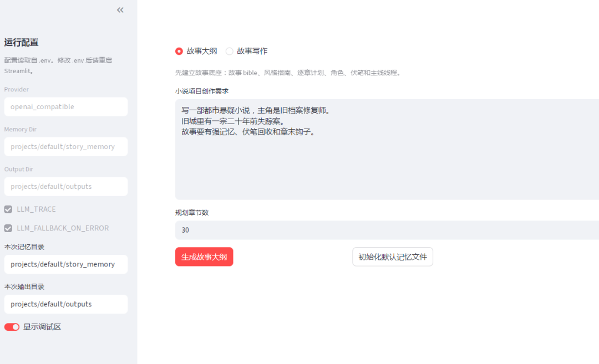
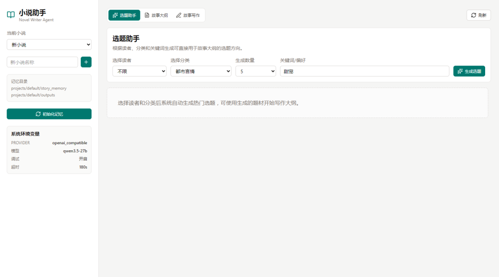
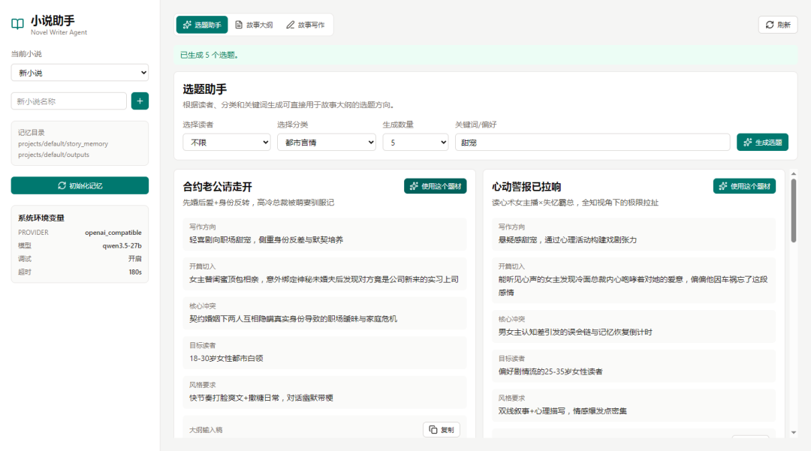
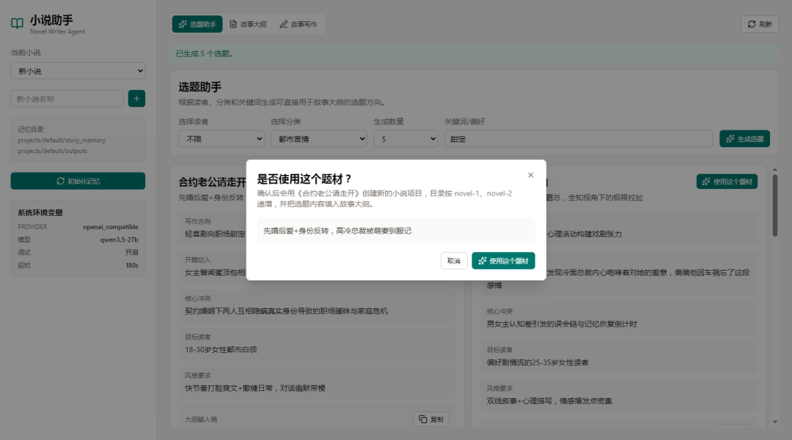
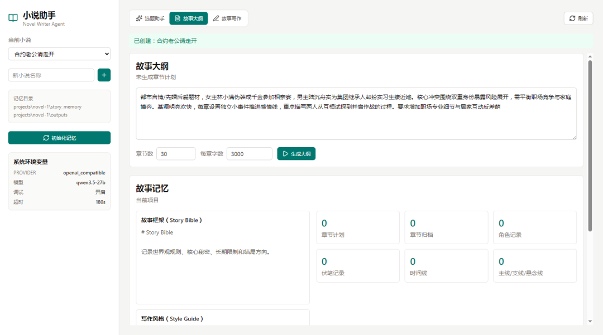
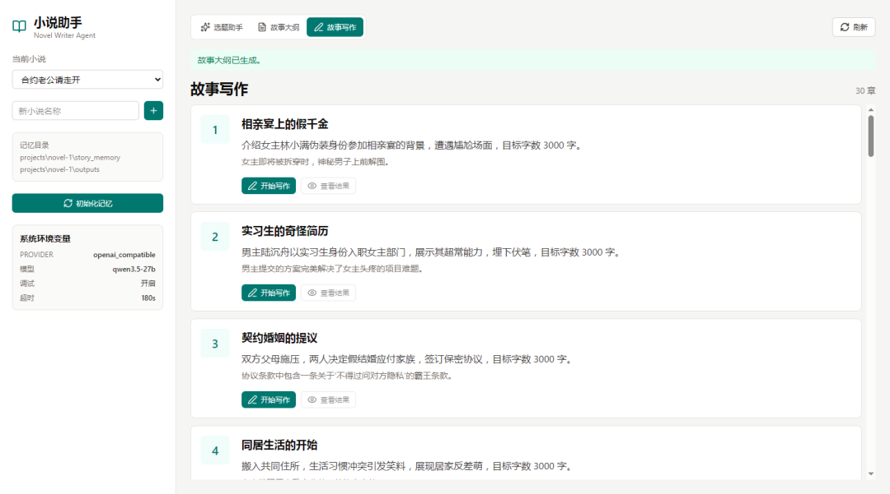
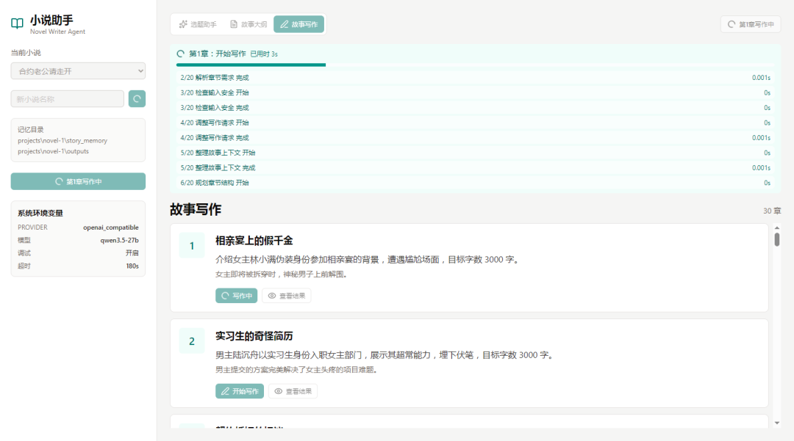
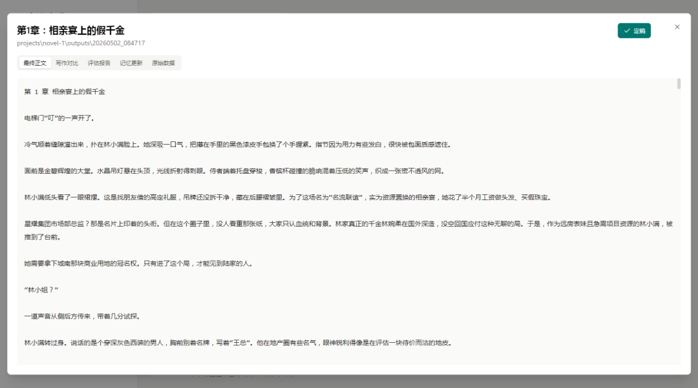
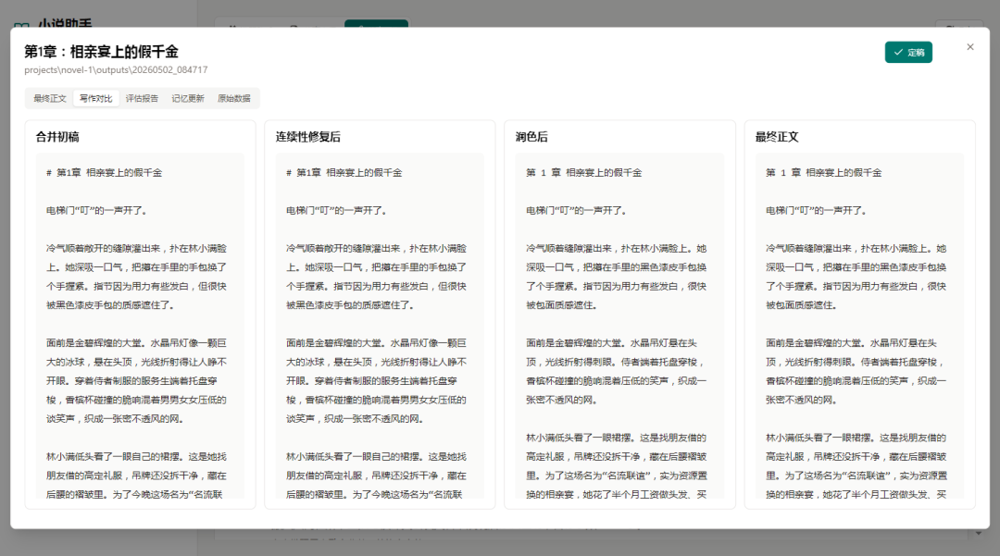
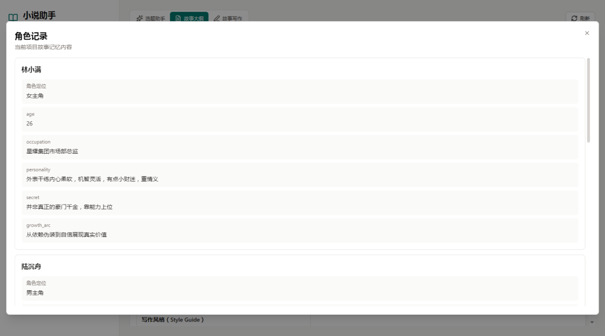

# 小说助手 Novel Writer Agent

小说助手是一个本地运行的 AI 小说创作工具，面向长篇小说的选题、大纲、章节写作、结果查看和故事记忆管理。

小说助手不是一次性生成整本小说，而是围绕“章节级写作 + 长期故事记忆”来工作：每次生成一章，同时维护角色、时间线、伏笔、主线/支线和章节归档，帮助后续章节保持连续性。

适合希望长期连载、持续打磨单章质量的作者使用。你可以先用选题助手生成题材方向，再生成完整故事大纲和章节计划，随后逐章写作、查看不同版本对比、阅读评估报告，并把每章产生的新线索、新角色状态和剧情变化沉淀到故事记忆中。这样既能保留 AI 写作的效率，也能让作者更直观地掌控整部小说的结构、节奏和伏笔推进。

章节生成通常需要较长时间，这是因为系统不是简单请求模型写一段正文，而是会按流程完成章节规划、正文生成、版本修订、连续性检查、体验评估、风险检查和故事记忆更新。相对普通“一次生成”的方式，它更重视章节质量、前后逻辑和可继续连载性，目标是生成更接近可发布状态的正文，减少人工反复做版本对比、逻辑检查和风险检查的工作量。

## 亮点功能

- 可视化查看 AI 生成的小说故事线，不只看单章正文，也能查看整部小说的推进脉络。
- 独立展示伏笔记录，方便跟踪伏笔的埋设、推进和后续回收。
- 独立维护主线、支线和悬念线，帮助长篇写作减少剧情断裂和线索遗忘。
- 章节写作不是单次生成，而是经过规划、生成、修订、评估和检查流程，输出质量更稳定，更适合直接进入发布前整理。
- 每章写作后生成体验评估，包含戏剧任务、连续性、读者钩子、叙事质感、口语自然度等维度。
- 每个章节都会生成记忆更新，可以查看本章对主线、角色、时间线和伏笔造成了哪些变化。
- 支持查看写作对比、评估报告和记忆更新，方便判断 AI 输出是否符合当前故事方向。

## 当前版本限制

当前版本仍属于早期可用版本，适合本地辅助创作和流程验证。以下能力还在完善中：

- 写作流程中的 `system_prompt` 和 `user_prompt` 目前主要写在代码中，暂未提供独立的提示词配置界面；有定制需求的用户可以自行修改代码，下个版本计划增加更灵活的提示词配置。
- 对话上下文和故事记忆的压缩能力还不够精细，长篇连续写作时会消耗较多 Token。
- Web 界面暂不支持直接编辑已生成的写作计划；如果需要调整章节计划，目前需要修改对应的记忆文件或重新生成大纲。

## 主要功能

- 选题助手：根据读者类型、小说分类和关键词生成多个题材方向。
- 大纲生成：根据创作需求生成故事框架、写作风格和章节计划。
- 章节写作：按章节计划生成单章正文。
- 写作进度：章节生成时显示友好的工作流进度。
- 结果查看：查看最终正文、写作对比、评估报告、记忆更新和原始数据。
- 定稿导出：将章节最终正文导出为普通 `.txt` 文本。
- 故事记忆：维护章节归档、角色记录、伏笔记录、时间线和主线/支线/悬念线。
- 多小说项目：不同小说使用独立目录保存写作记录。

## 运行环境

需要：

- Windows
- Python 3.10+
- 可用的 OpenAI 兼容模型接口 API Key

如果使用已经打包好的发布版本，运行时不需要 Node.js。

### 环境安装说明

普通用户只需要安装 Python，不需要安装 Node.js。

1. 下载并安装 Python 3.10 或更高版本：

```text
https://www.python.org/downloads/
```

2. 安装 Python 时请勾选：

```text
Add python.exe to PATH
```

3. 安装完成后，双击运行：

```text
初始化.bat
```

初始化脚本会自动完成：

- 检查 Python 是否可用
- 创建本地虚拟环境 `.venv`
- 安装项目依赖
- 引导填写模型供应商、模型名称和 API Key
- 生成 `.env` 配置文件

如果项目目录移动过，或虚拟环境失效，也可以重新运行 `初始化.bat`，脚本会尝试重建 `.venv`。

如果提示没有找到 Python，请重新安装 Python，并确认安装时勾选了 `Add python.exe to PATH`。

## 快速开始

第一次使用：

```text
双击 初始化.bat
```

按提示选择模型供应商，并输入模型名称和 API Key。初始化完成后会生成 `.env` 配置文件。

启动程序：

```text
双击 启动小说助手.bat
```

启动后浏览器访问：

```text
http://127.0.0.1:8000
```

## 基本使用流程

1. 进入“选题助手”，生成题材方向。
2. 点击“使用这个题材”，创建新的小说项目。
3. 进入“故事大纲”，设置章节数和每章字数，生成大纲。
4. 进入“故事写作”，选择章节并开始写作。
5. 写作完成后点击“查看结果”。
6. 满意后点击“定稿”，导出章节文本。

## 项目数据

小说项目默认保存在：

```text
projects/
```

每个小说项目包含：

```text
story_memory/   故事记忆
outputs/        每次写作的原始输出
```

定稿文本会输出到类似：

```text
projects/novel-1/小说名称/1-开端.txt
```

删除小说时，只会让该小说不再出现在小说助手中，不会删除 `projects/{小说}` 目录下的原始写作记录。

## 支持的模型接口

当前推荐使用 OpenAI 兼容接口。

初始化脚本内置了常见供应商选项，例如：

- 阿里百炼 DashScope
- OpenRouter
- DeepSeek
- 硅基流动 SiliconFlow
- 自定义 OpenAI 兼容接口

也可以手动编辑 `.env`：

```env
PROVIDER=openai_compatible
COMPAT_BASE_URL=https://openrouter.ai/api/v1
COMPAT_MODEL=你的模型名
COMPAT_API_KEY=你的API_KEY
LLM_TIMEOUT_SECONDS=600
```

如果对写作速度不要求的，可以申请openrouter的免费api-key
官网
[openrouter官方 https://openrouter.ai/](https://openrouter.ai/)
查看免费的模型
[openrouter官方免费模型列，后面有Free都是免费 https://openrouter.ai/models](https://openrouter.ai/models)


## 目录说明

```text
app/                  后端服务和写作工作流
web/dist/             Web 前端静态文件
scripts/init_env.py   初始化配置脚本
初始化.bat             初始化 .env 配置
启动小说助手.bat       启动本地服务
```

## 注意事项

- `.env` 中包含 API Key，请不要上传或分享。
- `projects/` 中包含个人写作数据，请自行备份。
- 小说助手生成时需要跑20个流程，目前对话压缩优化不好，因此比较耗费Token（谨慎使用）
- 章节生成可能需要 5 到 10 分钟，具体取决于模型速度和章节长度。
- 如果模型返回质量不稳定，可以更换模型或提高超时时间。
- 真实模型调用失败、超时、返回空文本或返回不可解析 JSON 时，程序会直接报错；只有显式选择 Mock 测试模式时才会使用本地测试数据。


## 截图










